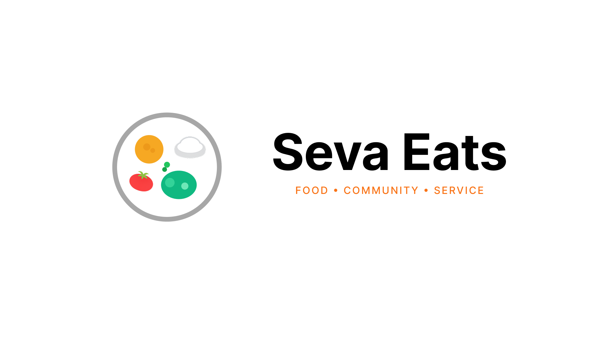

# Seva Eats Web



**Live app:** [https://sevaeats.vercel.app](https://sevaeats.vercel.app)

Seva Eats connects people who need langar meals with sevadars who pick up at gurdwara hubs and deliver with dignity. This is the web app (Next.js), paired with the Expo mobile app in `sewa-eats`.

## Local development

```bash
cp .env.example .env.local
# Set NEXT_PUBLIC_SUPABASE_URL and NEXT_PUBLIC_SUPABASE_ANON_KEY

npm install
npm run dev
```

Open [http://localhost:3000](http://localhost:3000). In Supabase **Authentication → URL configuration**, allow `http://localhost:3000/auth/callback` and `https://sevaeats.vercel.app/auth/callback`.

Agent and routing notes: [AGENTS.md](./AGENTS.md), [docs/ROADMAP.md](./docs/ROADMAP.md).
