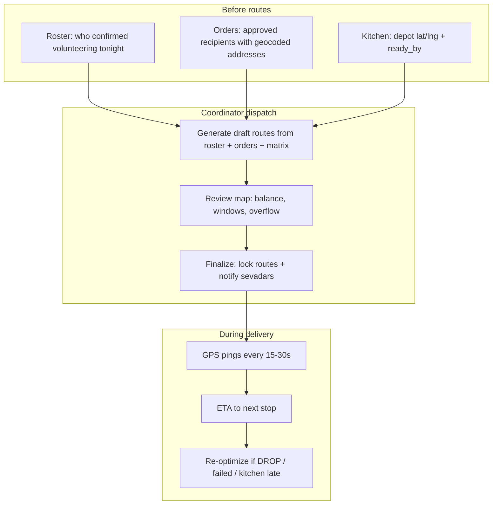

# Seva Eats — Route Optimization

Technical spec for dispatch routing: inputs, algorithm versions, storage, APIs, and live tracking. **Agents:** also read `.agents/skills/seva-routing/SKILL.md`.

For **who does what on a service night** (roster → locations → optimize → track), read [Service night playbook](#service-night-playbook) below. Phased implementation order is in [ROADMAP.md](./ROADMAP.md).

For **math and algorithms** (CVRPTW, k-means, Hungarian, TSP 2-opt, constraints): [ROUTE_OPTIMIZATION.md](./ROUTE_OPTIMIZATION.md).

---

## Service night playbook

Dispatch is not a one-click “shortest line on a map.” It is a **repeatable operations process** run by a coordinator, backed by Postgres and server-side APIs, so recipients get meals on time and sevadars drive as little as necessary while still serving everyone.

### Roles each night

| Role | Responsibility |
|------|----------------|
| **Coordinator** (`staff.role = dispatcher`) | Confirms tonight’s volunteer roster, approves recipient orders, runs generate/review/finalize, watches live map |
| **Kitchen** (`kitchen_manager`) | Publishes menu, sets `ready_by`, gates packing → ready |
| **Sevadar** (`drivers`) | Confirms availability, accepts assigned route, pings GPS during shift, completes stops |
| **Recipient** | Submits request; sees tracking only for their order (RLS) |

### End-to-end flow



### Step 1 — Build the confirmed volunteer list

**Goal:** Only people who are actually serving **delivery** tonight enter the optimizer. Ingredient / roti / packing sevadars are tracked separately (future `shifts` / `driver_seva_preferences`); they do not get `driver_routes` until they are on a **delivery** shift.

| Data | Suggested storage | Rule |
|------|-------------------|------|
| Registered sevadar | `drivers` linked to `users.auth_id` | Created on volunteer sign-in |
| Signed up for tonight | `shifts` or `driver_availability` *(migration)* | `service_date`, `kitchen_id`, `seva_type = delivery` |
| **Confirmed** by coordinator | `shifts.status = confirmed` or `drivers.available_tonight = true` | Only **confirmed** rows go into `driverIds` for generate |
| Live start position | `drivers.current_latitude/longitude` or profile home | At generate time: prefer last ping, else last known home |

**Coordinator UI (Phase 4):** Roster panel — checklist of tonight’s sign-ups → toggle **Confirmed** → map pins for confirmed drivers vs kitchen (Gurdwara depot).

**Exit:** Generate API receives `driverIds[]` that are a subset of “signed up,” all coordinator-confirmed.

### Step 2 — Collect locations (three point types)

All optimization uses **road-network drive time**, not straight-line distance.

| Point type | Source | Used for |
|------------|--------|----------|
| **Depot (Gurdwara / kitchen)** | `kitchens.latitude`, `kitchens.longitude` | Every route starts/ends here (pickup trays) |
| **Recipients** | `orders.delivery_latitude/longitude` after geocode on submit | Stop locations; time windows from `orders` |
| **Sevadars** | `drivers.current_*` at generate, or shift start address | **Cluster assignment** — assign nearby stops to the driver already closest to that area |

Relative geometry matters: a driver south of the Gurdwara should not be given only north-end drops unless load balancing requires it. The **assign** step (Hungarian / min-cost) uses matrix times **depot → driver → stops → depot**, not haversine.

### Step 3 — Shortest paths for everyone (VRP heuristic)

**Hard constraint:** Every approved order for tonight appears on exactly one route (or lands in `overflow` for coordinator manual fix).

**Soft goals (in order):**

1. **Coverage** — no recipient left unassigned  
2. **Freshness** — minimize time from kitchen ready → first drop  
3. **Fairness** — similar stop counts per driver (`max_stops`, vehicle capacity)  
4. **Less driving** — minimize **total** drive minutes across all drivers (not one hero route and three huge ones)

Algorithm (Phase 5, `lib/routing/`):

1. **Cluster** recipients in geographic groups (k-means, k ≈ number of confirmed drivers)  
2. **Assign** clusters to drivers using drive-time cost from each driver’s start position to cluster centroid  
3. **Sequence** each route: TSP on matrix (nearest-neighbor + 2-opt), depot → stops → depot  
4. **Validate** capacity, max drive duration, delivery windows; push violations to `overflow[]`

This is “shortest path” in the **operations** sense: each sevadar gets a sensible loop; the **system** minimizes total driving while serving all addresses.

### Step 4 — Human review and lock

- **Generate** writes `driver_routes` + `route_stops` as **`draft`** (safe to re-run).  
- Coordinator drags stop order, swaps drivers, drops a stop.  
- **Finalize** sets **`assigned`**, links `deliveries`, sends notifications (app + later WhatsApp).

Sevadars only see routes after finalize (Phase 3 `/seva` reads SQL).

### Step 5 — Live tracking and mid-shift changes

| Event | Backend | UI |
|-------|---------|-----|
| Sevadar starts shift | `driver_routes.status = in_progress` | `/seva` turn-by-turn list |
| GPS ping | `POST /api/drivers/location` → `drivers.current_*` + `driver_location_pings` | Coordinator map + recipient tracking |
| Approaching stop | Matrix driver → next pending `route_stop` | Update `estimated_arrival_at` (throttled) |
| Stop complete | `route_stops.status = completed` | Next stop highlighted |
| DROP / failed / kitchen late | Re-run optimizer on **remaining** stops (Phase 8) | New draft or route version; Realtime push |

**Never** run the optimizer in the browser; coordinator clicks **Generate** → server → Postgres.

---

## Problem

Each service night the **coordinator** must assign many recipients to **sevadars** (drivers) so that:

1. Every approved recipient gets a delivery
2. Food stays hot (minimize kitchen→door time)
3. Load is balanced across volunteers
4. Drive time and constraints (windows, capacity, max stops) are respected

This is a **capacitated vehicle routing problem (VRP)** with time windows, not just “draw lines on a map.”

---

## Inputs

| Input | Source |
|-------|--------|
| Recipients | `orders` where status approved/ready, with `delivery_*` lat/lng |
| Sevadars | `drivers` available tonight: `current_*`, vehicle capacity, max stops |
| Depot | `kitchens.latitude/longitude`, `menus.ready_by_at` |
| Constraints | Max stops per route, max drive duration, delivery window per order |
| Distances | **Drive time matrix** from Mapbox Matrix API or Google Routes API (not haversine alone) |

Optional: live positions from `drivers.current_*` or `driver_location_pings` for re-optimization mid-shift.

---

## Outputs

Written to Postgres (never only in client memory):

| Table | Content |
|-------|---------|
| `driver_routes` | One row per sevadar per night: `kitchen_id`, `route_date`, `status` (`draft` → `assigned` → `in_progress` → `completed`) |
| `route_stops` | Ordered stops: `stop_sequence`, lat/lng, link to `delivery_id`, ETA fields |
| `deliveries` | Per-order assignment: `driver_id`, `route_id`, `route_stop_id` |
| `route_optimization_runs` | *(migration)* snapshot of input JSON, output JSON, who ran it, `created_at` |

---

## Algorithm versions (build in order)

### v0 — Manual (Phase 4)

- Coordinator assigns orders to drivers in admin UI
- Drag-and-drop stop order
- Preview distances with Postgres `earthdistance` (already installed) or one-off matrix call
- **No** k-means/TSP yet

### v1 — PRD heuristic (Phase 5)

Full formulas and pseudocode: **[ROUTE_OPTIMIZATION.md](./ROUTE_OPTIMIZATION.md)**.

Implement in **`lib/routing/`** (pure TypeScript, unit-tested):

```
A. Geocode any missing addresses → geo_cache
B. Cluster recipients by proximity (k-means, k = number of available drivers)
C. Assign clusters to drivers (Hungarian algorithm or min-cost greedy if ≤10 drivers)
D. Per route: sequence stops with TSP nearest-neighbor + 2-opt on DRIVE TIME matrix
E. Validate: capacity, time windows, max drive time; overflow → next-nearest driver or flag coordinator
```

**Optimization priority (PRD):**

1. Coverage — every recipient served  
2. Freshness — minimize kitchen-to-door time  
3. Sevadar comfort — balanced stop count  
4. Vehicle efficiency — minimize total drive time  

### v2 — Time-window VRP (only if v1 misses SLA)

- Google OR-Tools (Python worker) or similar for &lt;30 stops with hard windows
- Trigger only when heuristic repeatedly violates max drive time in production

### v3 — Live re-optimization (Phase 8)

**Triggers:** sevadar DROP, `delivery.failed`, kitchen late (`ready_by` slip)

- Freeze `completed` / `arrived` stops
- Re-run v1 on remaining stops and active drivers only
- Bump `driver_routes` version or create new draft route; notify via Realtime + WhatsApp

---

## Where code runs

| Component | Location |
|-----------|----------|
| Pure algorithm | `lib/routing/cluster.ts`, `assign.ts`, `sequence.ts`, `validate.ts` |
| Matrix client | `lib/routing/matrix.ts` (server-only) |
| HTTP entry | `app/api/dispatch/generate/route.ts`, `app/api/dispatch/finalize/route.ts` |
| Long jobs | Vercel Workflow or Supabase Edge Function if &gt;10s |
| Secrets | `MAPBOX_ACCESS_TOKEN` / `GOOGLE_MAPS_API_KEY` — server env only |

**Never** import OR-Tools or matrix clients in `'use client'` pages.

---

## API contract (draft)

### `POST /api/dispatch/generate`

```json
{
  "kitchenId": "uuid",
  "serviceDate": "2026-06-04",
  "driverIds": ["uuid", "..."],
  "orderIds": ["uuid", "..."]
}
```

**Response:** `{ "runId": "uuid", "routes": [ { "driverId", "stops": [...], "metrics": { "totalDriveMin", "maxLateness" } } ], "overflow": [...] }`

Persists `driver_routes` + `route_stops` in **`draft`** status.

### `POST /api/dispatch/finalize`

```json
{ "runId": "uuid" }
```

- Sets routes to **`assigned`**
- Updates `deliveries`
- Inserts `notifications`
- Fan-out WhatsApp/push (Phase 7)

Coordinator UI shows **ceremonial** confirmation (PRD: radiating wave) — product polish, not algorithm.

---

## Live tracking (SQL + Realtime)

### Write path (sevadar app)

```
Every 15–30s while route in_progress:
  POST /api/drivers/location { lat, lng, routeId }
    → UPDATE drivers SET current_*, location_updated_at
    → INSERT driver_location_pings
```

### Read path

| Viewer | Subscription |
|--------|----------------|
| Sevadar | `route_stops` for own `route_id`; next stop highlight |
| Recipient | `deliveries` + driver position for **own** `order_id` only (RLS) |
| Coordinator | All drivers/routes for `kitchen_id` + `route_date` |

### ETA

On each ping (throttled): matrix from driver → next `pending` stop → update `route_stops.estimated_arrival_at`.

---

## Geocoding

| Stage | Approach |
|-------|----------|
| Intake | Geocode on order submit; store on `orders` |
| Cache | `geo_cache` keyed by normalized address hash |
| Fallback | Mapbox Geocoding or Google Geocoding API |

PostGIS is **optional** (available on Supabase but not required for v1). Use matrix API for road network distances.

---

## Testing

| Layer | What |
|-------|------|
| Unit | `lib/routing/*` with fixture coordinates (5 stops, 2 drivers, 1 overflow) |
| Integration | generate → finalize → sevadar reads `/seva` from DB |
| Manual | Admin seed + dispatch board with 10 Brampton addresses |

Golden files: `lib/routing/__fixtures__/brampton-five-stops.json`

---

## Current implementation (Phase 0)

- **Mock only:** `constants/volunteer-deliveries.ts` + local state on `app/seva/page.tsx`
- **Maps scaffold:** `components/map/SevaMap.tsx` + `lib/map/config.ts` (MapLibre / Mapbox token) — not yet on tracking or dispatch board
- **DB tables exist** but empty: `driver_routes`, `route_stops`, `deliveries`
- **No roster or generate API yet** — confirmed-volunteer list and VRP are documented above; build per [ROADMAP.md](./ROADMAP.md) Phases 0 → 4 → 5 → 8

### Recommended build order (backend + everyone)

| Order | What | Why |
|-------|------|-----|
| 1 | Phase 0 — `orders` in SQL, types, `drivers` on volunteer sign-in | Optimizer needs real recipient coordinates and driver rows |
| 2 | Phase 1 — geocode on submit, Realtime on tracking | Recipients and coordinator see truth from DB |
| 3 | Phase 2 — `/admin`, staff auth, seed data | Coordinator can confirm orders and practice roster |
| 4 | Migration — `shifts` / availability + `driver_location_pings` | Confirmed list + live tracking storage |
| 5 | Phase 3 — `/seva` from `driver_routes` + location API | Sevadars execute routes; pings feed map |
| 6 | Phase 4 — manual dispatch + roster confirm UI | Operations workflow without solver risk |
| 7 | Phase 5 — `lib/routing` + `POST /api/dispatch/generate` | Automated shortest-path planning |
| 8 | Phase 8 — re-optimize on DROP / failure | Keeps night feasible when reality changes |

---

## Environment variables (future)

```env
# Required today
NEXT_PUBLIC_SUPABASE_URL=
NEXT_PUBLIC_SUPABASE_ANON_KEY=

# Phase 1+
MAPBOX_ACCESS_TOKEN=          # server
# or
GOOGLE_MAPS_API_KEY=          # server (matrix + geocode)
```

Add to `.env.example` when integrations land.
